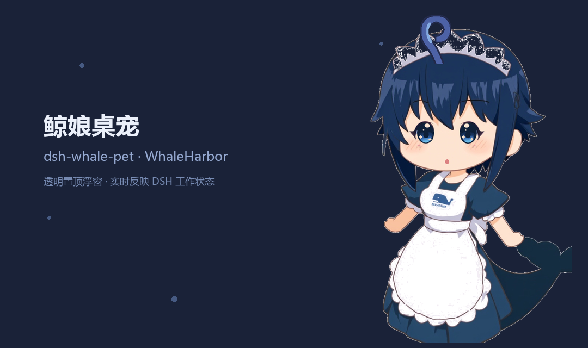
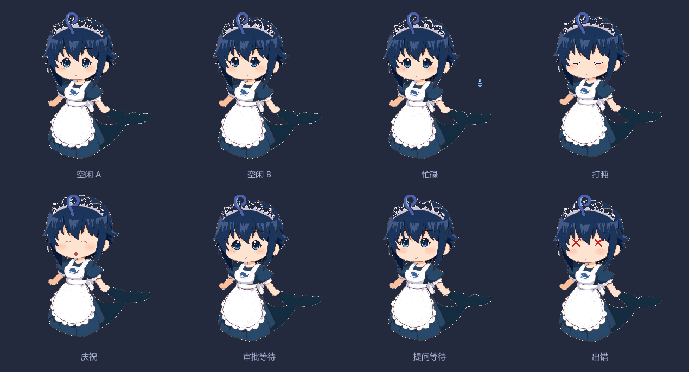
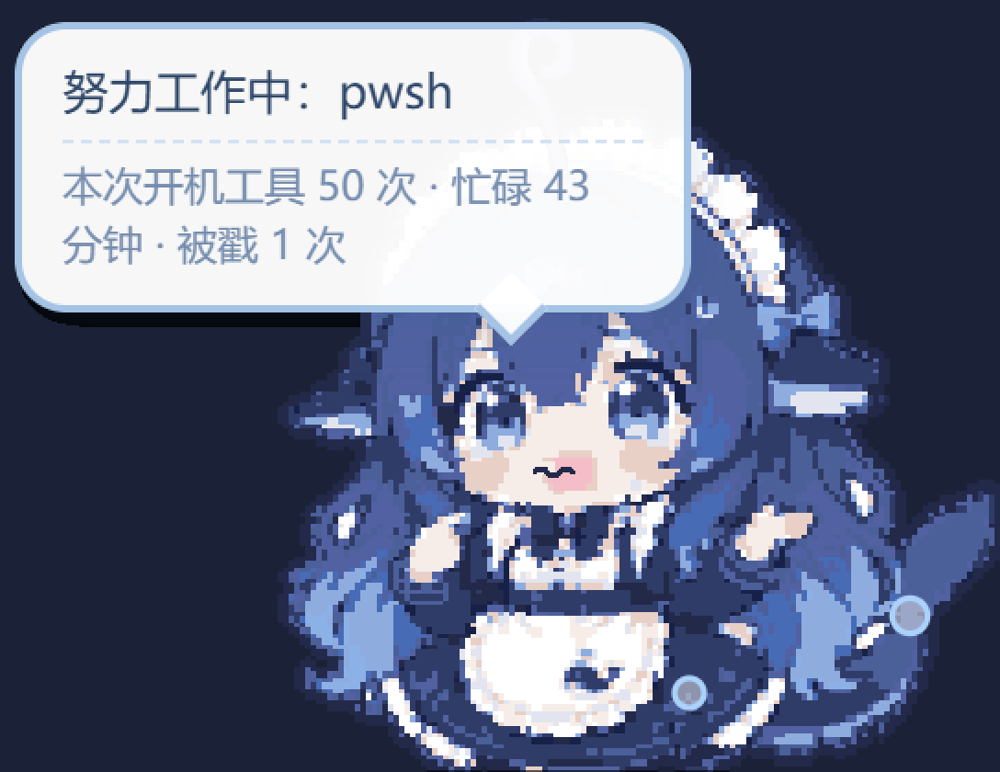

# dsh-whaleharbor-pet · 鲸娘桌宠

鲸港 WhaleHarbor 的**大白鲸娘桌面窗宠**：一只透明、置顶、不抢焦点的悬浮小鲸娘，实时反映 DeepSeek Harness（DSH）的工作状态。

形象采用 **px-v42 像素画拆件 + CSS 纸片人动画**：原画拆成 13 个零件（底座/眼×4/嘴×6/呆毛/汗滴），底座擦除与表情件重组误差为 **0 像素**，动作全部由 CSS keyframes 驱动（呼吸、眨眼、呆毛摇摆、汗滴、蹦跳、抖动），60fps、缩放无损。



## 状态表情



| 状态 | 触发 | 表现 |
|---|---|---|
| 空闲 A/B | 无任务 | 呼吸浮动 + 眨眼 + 呆毛摇摆；两种 idle 每 18s 随机轮换（B 有快速双眨和视线偷瞄）；每 9s 轮换闲扯台词 |
| 忙碌 | 主 agent 运行 / 根工具执行 / 子代理 / 工作流 | 快速浮动 + 波浪嘴 + 汗滴滑落 + 冒泡，气泡显示当前工具名 |
| 审批等待 | `approval/request`（主 agent） | 头顶红色 `!` 徽章 + O 嘴 + 歪呆毛 + 提示气泡 |
| 提问等待 | `user-questions/request`（主 agent） | 头顶蓝色 `?` 徽章 + 瞳孔偏移 + 呆毛大摆 |
| 出错 | `agent/error`（主 agent） | XX 眼 + 高频抖动 + 橙色 `✕` 徽章 8 秒 |
| 完成庆祝 | 忙碌 → 空闲跳变 | 蹦跳三下 + ∩∩ 笑眼 + 开怀大笑 + 星星爱心 6 秒 |
| 打盹 | 连续空闲 3 分钟 | 慢深呼吸 + 闭眼 + 画面变暗 + `Z z z` |
| 子代理分身 | `subagent/start` 存活数 | 右下角小鲸鱼（最多 6 只） |

气泡副栏实时统计：本次开机工具调用数、累计忙碌分钟、被戳次数。



> 桌面实拍：忙碌状态（pwsh 工具运行中），气泡为实时统计，右下为子代理分身。

**支持平台**：需要 WhaleHarbor 桌面壳提供浮窗能力（当前发布 Windows 构建）；插件本体是纯 Web 技术（DOM + CSS 动画），壳支持更多平台后即随之可用。

## 交互

- **拖动**：按住鲸娘或空白处拖动（壳的 float-preload 实现，零页面协议）
- **戳一戳**：点击鲸娘 → 压缩回弹动画 + 随机吐槽，计数上报
- **右键**：原生菜单 —— 小号/中号/大号（重建浮窗，状态自动续上）、隐藏
- **托盘菜单**（WhaleHarbor 托盘）：状态行 + 「显示/隐藏鲸娘」
- **悬停**：显示状态气泡

## 架构

```
DSH 核心进程（本插件 Host 半部，index.js）
  │  监听 agent/status、tools/execute、approval/request、user-questions/request、
  │  subagent/start|end、workflow/start|end、agent/error（subagent 按 session header 过滤）
  │  聚合成 ≤2.5KB 状态快照
  ▼
RPC 桥  http://127.0.0.1:<随机端口>（DSH_DESKTOP_NOTIFY_PORT/_TOKEN，请求体上限 4KB）
  │  float.window.create（url 模式：内联 html 超 4KB 会被静默断开，
  │  页面与零件由插件本地服务器自取：/pet.html + /parts/*.png，路径白名单 404 兜底）
  │  → float.window.state（1s 节流，变化才推）
  │  float.window.menu（右键原生菜单）
  ▼
WhaleHarbor 壳：透明显示浮窗（floating 置顶 / focusable:false / 不进任务栏）
  ▲  反向通道（插件自起 127.0.0.1 eventPort）
  └── float.window.input（戳一戳）/ float.window.menu.click / float.window.closed
```

- 页面是一张零件叠加的 DOM：底座常驻，表情件按 mood class 切换透明度，动作全在 CSS keyframes（`translateY` 相对自身盒高，窗口三档尺寸自适应）。
- 零件缺失（打包漏发 `parts/`）时自动退回占位鲸鱼，不白屏。
- 桥不可达（纯浏览器/CLI 启动、旧壳、浮窗开关关闭）时**安静空转**，无任何副作用。
- 卸载/HMR/核心退出时 `ctx.effect` 清理：`float.window.closeAll` + 托盘分区清除 + 事件服务器关闭。
- 窗口是壳的资产：核心重启时代际清理，宠物不会变孤儿。

## 安装

```bash
dsh plugin --profile web add @duke-dsh-plugins/dsh-whaleharbor-pet
```

> 国内网络请显式指定 `--registry=https://registry.npmjs.org`（本机默认 registry 常被镜像源覆盖）。

装完**必须重启 DSH 核心**生效（桌面壳 Ctrl+Alt+R 或设置 → 核心 → 重启）。

## 本地开发

```bash
node --check index.js                  # 语法检查
node -e "console.log(require('./index.js')._buildPetPage())"   # 导出浮窗页面
```

页面通过插件事件服务器提供 `/pet.html` 与 `/parts/*.png`；开发时用任意静态服务器指向本目录即可预览（支持 `?mood=idle-a|idle-b|busy|nap|celebrate|approval|question|error` 钉死状态）。

## 已知边界

- 改大小 = 关窗重建（浮窗宽高创建即固定），位置回到默认右下角。
- `float.window.state` 是替换最新值语义：页面刷新自动补发最新状态。
- 每插件浮窗限额 3 / 全局 6；本插件只用 1。

## License

[MIT](LICENSE) © dukebywwh
